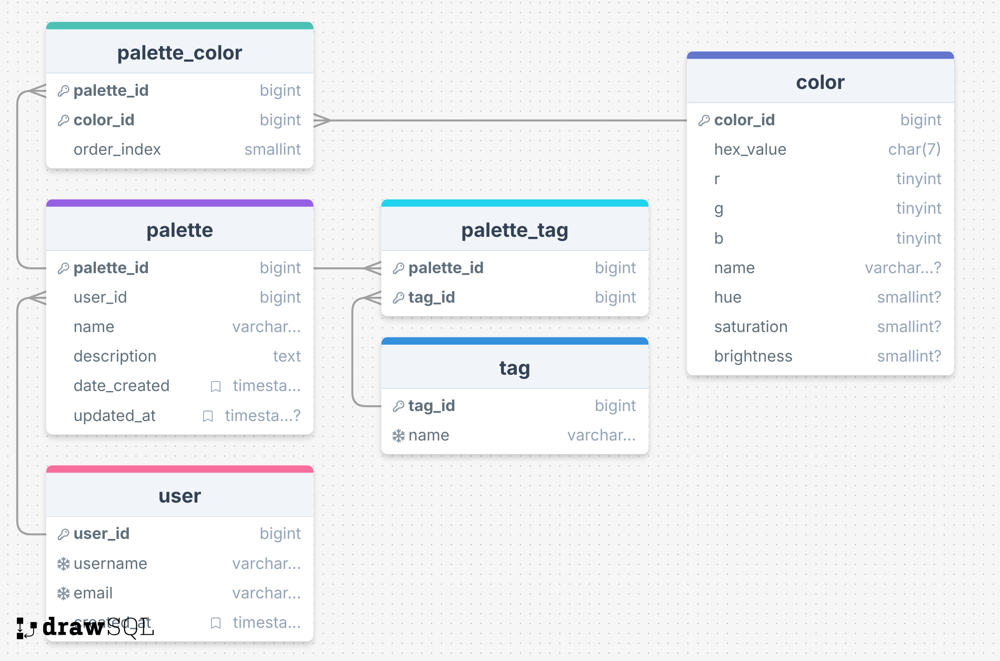

# 🎨 Color Palette Database  
*A SQL-based web app for organizing, exploring, and visualizing color palettes.*

---

## 📘 Overview
The **Color Palette Database** is a data management project that will allow users to create, store, and browse custom color palettes. Stretch goals for the project include: ability to export palettes (for printing), and extracting palettes/colors from imported images.
Each palette can include multiple colors, tags, and descriptions, enabling artists, designers, and crafters to organize their inspiration in one searchable place.

This project demonstrates **relational database modeling, SQL queries, and CRUD operations** using PostgreSQL and Flask (Python).  
- CRUD operations involve Creating, Reading, Updating, and Deleting SQL data.
- Flask will handle basic web development
  
This was developed as a final project for BYU's **Database Modeling Concepts** course.

---

## 💡 Features to Implement
- Simple login with username and email
- Create, view, edit, and delete color palettes
- Store individual colors with HEX (and possibly RGB, hue data)
- Tag palettes by theme, mood, or use case (e.g., *"vintage"*, *"modern"*)  
- Search palettes by color or tag
- Search palettes, colors, tags by name 
- Visual display of palettes using CSS color blocks
- (Stretch goal) Create palette from imported picture
- (Stretch goal) Download palette for printing
- (Stretch goal) Implement this as a public web application using Render or PythonAnywhere.

---

## 🧩 Database Schema

**Core Tables**
- `user` — stores user information
- `palette` — stores palette information  
- `color` — stores color properties (hex, rgb, hue, etc.)  
- `palette_color` — many-to-many relationship between palettes and colors  
- `tag` — stores tags or categories  
- `palette_tag` — many-to-many relationship between palettes and tags  

**Relationships**
- Each palette can include many colors and many tags  
- Each color can appear in multiple palettes  
- Each tag can apply to multiple palettes  



---

## 🧰 System Design - Technologies Used
| Layer | Technology | Purpose |
|--------|-------------|----------|
| Database | **MySql or SQLlite** (or SQLite) | Main SQL database |
| Backend | **Python (Flask)** | API + database connection |
| Frontend | **HTML, CSS, JavaScript** | Display palettes and forms |
| Version Control | **Git + GitHub** | Version tracking and public repo |
| Optional WebHosting Platform | **Render** or **PythonAnywhere** | Hosting the webpage and Database |
| Optional | **Chart.js / Tailwind CSS** | Data visualization or styling |


## Project Calendar

| Week        | Mon          | Tue          | Wed          | Thu          | Fri          |
|------------|--------------|--------------|--------------|--------------|--------------|
| Nov 4–8    | -            | -            | Refactor database schema, add indexes/constraints for performance | Write SQL queries to test joins and relationships, plan sample data | Insert sample data into tables, test queries, plan initial Flask app |
| Nov 11–15  | Finalize project idea, refine schema | Research Flask + MySQL setup, plan CRUD operations | Create Flask routes: Read palettes/colors/tags | Create Flask routes: Create new palettes/colors/tags | Create Flask routes: Update palettes/colors/tags |
| Nov 18–22  | Create Flask routes: Delete palettes/colors/tags | Build basic UI to view palettes/colors/tags | Add search/filter functionality | Polish UI, add color display | Add validations, error handling, test edge cases |
| Nov 25–29  | Plan advanced UI/UX, sketches | Set up Flask templates and styling | **Thanksgiving break – no work** | **Thanksgiving break – no work** | **Thanksgiving break – no work** |
| Dec 2–6    | Integrate UI with CRUD backend, test functionality | Continue integration & bug fixes | Polish UI and workflow | Create ER diagram, add diagrams/images to README | Record demo, finalize README, polish repo |
| Dec 9–10   | Final polish, test everything | Submit project, final check | - | - | - |

## 🧩 Visualization

Below are several sketches of what the UI could look like:

  

  

  


  
---

## 🚀 Getting Started

### 1. Clone the repository
```bash
git clone https://github.com/yourusername/color-palette-database.git
cd color-palette-database

